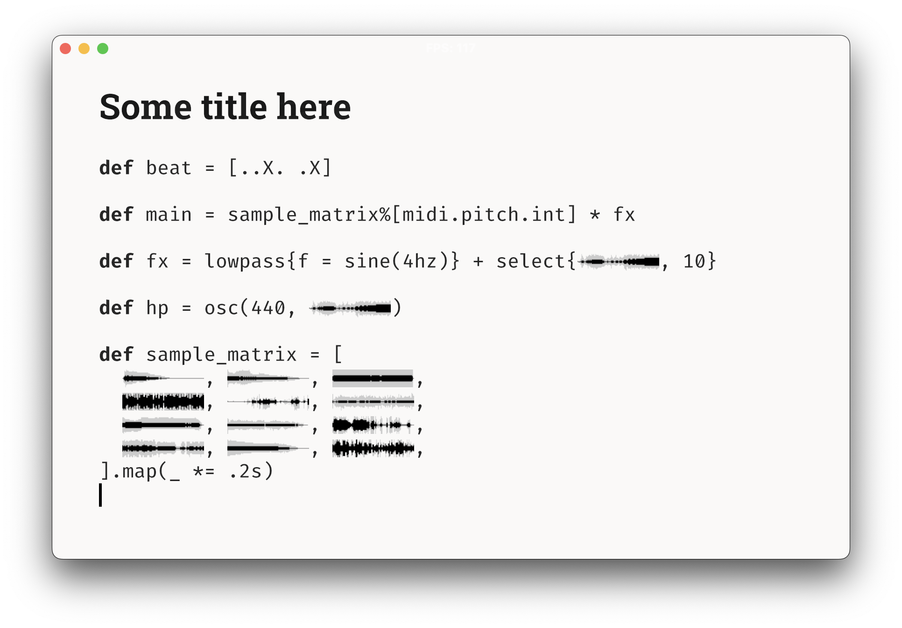
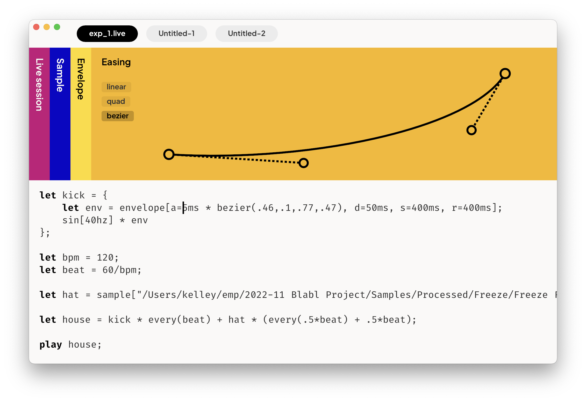
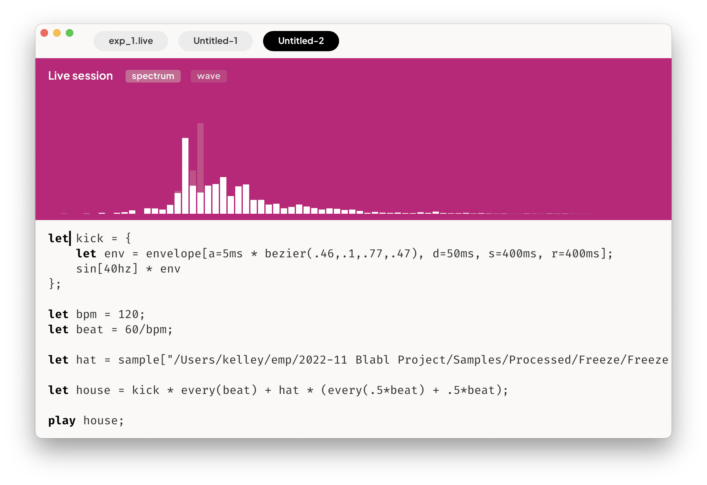

# Rust audio livecode editor

**My slow path towards an audio livecoding system, built entirely in Rust 🦀**

This is my most ambitious Rust project so far (and also just most ambitious hobby project in a while), and I want to get down to the bottom of all the parts involved, which means I'm taking the slow roundabout path, trying to build most of the things from scratch, which includes:

- **(Lossless) parsing**

  - Because in an IDE, you need to be able to interact with the code, even if it contains errors.
  - I haven't started on this part yet, but I aim to either work with [`rowan`](https://github.com/rust-analyzer/rowan), or do something with error recovery and parser combinators (see [this blog article](https://eyalkalderon.com/blog/nom-error-recovery/) and [this library](https://github.com/zesterer/chumsky/)).

- **Low-level graphics APIs**

  - I'm using [wgpu](https://wgpu.rs/) to draw pixels. The inspiration came from reading [this blog post](https://zed.dev/blog/videogame) from Zed.

- **GUI**

  - In the folder `/editor`, there's my first proof-of-concept editor, written directly on top of wgpu and winit.
    - (I hand-patched it locally to overcome the drag+drop cursor positioning [issue](https://github.com/rust-windowing/winit/issues/1550) with this [proposed PR](https://github.com/rust-windowing/winit/pull/2615).)
  - But, after making a first proof-of-concept, and adding the first widgets, it becamse clear that it would be a problem to do more ambitious GUI in a more scalable way. As [Rust is not GUI yet](https://areweguiyet.com/), this is an interesting one.
  - I'm planning to write my own retained mode UI. When I was struggling with instructing wgpu to draw text and shapes and lines etc, in a certain order, my attention was drawn by `epaint`, an underlying part of [`egui`](https://www.egui.rs/) that does these things very nicely and backend-agnostically. So I'd like to use epaint, without egui, and build a retained-mode GUI abstraction over it.
  - I have a _very minimal proof of concept_ of having been able to separate epaint from egui, in the `/using_epaint_wgpu` folder atm.
  - But, to get at least somewhere, faster, I also started prototyping the UI in egui, in the folder `/using_egui_wgpu_old`. This is my second reasonable and working prototype.

- **DSP & the language runtime**

  - ..much to learn and figure out

- **Code editor logic**

  - Building the logic around editing code with multiple selections, etc., is quite challenging but fun on its own :P I decided that I might as well make this deep-dive, after I already touched on it with another hobby-project of mine: [ASCII recipes](https://asciirecip.es/)

## First prototype

See `/editor`

The **killer features**:

- Multi-selection editing
- You can drag an audio sample into the editor and it instantiates a widget with the sample's waveform — the sample widget is like any other character, in that you can copy/paste it, move it around, etc.

## Second prototype

See `/using_egui_wgpu_old`

The new **killer features**:

- "Artist impression" of the UI I think I'm going for, with some basic proof of concept interactions
- A working "Easing" dashboard widget
- Audio spectrum & waveform from microphone input, in the "Live session" dashboard widget

